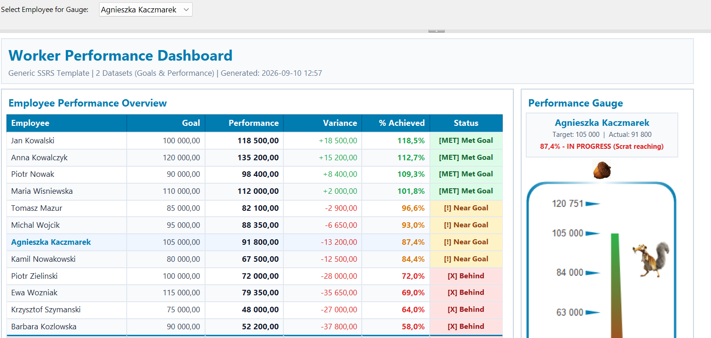

# 📊 Worker Performance Dashboard — SSRS Template

[](https://learn.microsoft.com/en-us/sql/reporting-services/)
[](https://powerbi.microsoft.com/en-us/report-server/)
[](https://www.microsoft.com/sql-server)
[-orange.svg)](./LICENSE.md)
[](#customization-guide)

A ready-to-deploy, modern **SQL Server Reporting Services (SSRS)** and **Power BI Report Server (PBIRS)** dashboard template designed for tracking worker performance, targets, variances, and achievement rates.

This template showcases advanced SSRS design techniques, clean executive UI aesthetics (Segoe UI typography and soft slate/cyan accents), and the multi-dataset `Lookup()` pattern to decouple target metrics from actual performance transactions.

<p align="center">
  
</p>

---

## 📑 Table of Contents

- [Overview & Key Features](#-overview--key-features)
- [Architecture & Design Patterns](#-architecture--design-patterns)
  - [Dual-Dataset Architecture](#1-dual-dataset-architecture)
  - [SSRS Lookup() Pattern](#2-ssrs-lookup-pattern)
  - [Dynamic KPI Gauge & Gamified Indicators](#3-dynamic-kpi-gauge--gamified-indicators)
  - [Tabular Overview & Aggregation Footer](#4-tabular-overview--aggregation-footer)
- [Supported Versions & Compatibility Matrix](#-supported-versions--compatibility-matrix)
- [Prerequisites & Tools Needed](#️-prerequisites--tools-needed)
- [Deployment Guide](#-deployment-guide)
  - [Step 1: Deploy Database & Sample Data](#step-1-deploy-database--sample-data)
  - [Step 2: Configure Connection in Report Builder or SSDT](#step-2-configure-connection-in-report-builder-or-ssdt)
  - [Step 3: Deploy to SSRS / PBIRS Web Portal](#step-3-deploy-to-ssrs--pbirs-web-portal)
- [Customization Guide](#-customization-guide)
- [Deploying to Your GitHub](#-deploying-to-your-github)
- [Where Can This Template Be Published?](#-where-can-this-template-be-published)
- [Troubleshooting & FAQ](#-troubleshooting--faq)
- [License](#-license)

---

## 🌟 Overview & Key Features

Modern paginated reports often suffer from cluttered layouts and rigid single-query datasets. This template provides a production-grade boilerplate that solves common reporting hurdles:

| Feature | Description |
| :--- | :--- |
| 🎨 **Executive Design** | Sleek palette (`#007cb1` blue, slate gray `#64748b`, light gray cards `#f8fafc`) with consistent Segoe UI typography. |
| ⚡ **Dual-Dataset Pattern** | Separates static targets (`Goals`) from transactional aggregations (`Performance`), joined client-side in the report via `Lookup()`. |
| 🎯 **Interactive Gauge** | Radial gauge dynamically reflects the individual selected via the `Employee` report parameter. |
| 📈 **Executive KPI Card** | Displays Target, Actual, % Achieved, and goal outcome at a glance. |
| 📋 **Overview Tablix** | Detailed table with variances, achievement percentages, and conditional status tags (`[MET]`, `[!]`, `[X]`). |
| 🧮 **Dataset-Scoped Footer** | Demonstrates how to calculate team totals across separate datasets using `Sum(..., "Goals")`. |
| 🐿️ **Gamified Visual Cues** | Includes embedded visual feedback (e.g. Scrat reaching vs. holding the acorn) indicating threshold achievement. |

---

## 🏗️ Architecture & Design Patterns

### 1. Dual-Dataset Architecture

Rather than joining disparate systems or tables with complex SQL JOINs and outer queries, the report consumes two distinct datasets:

```
                  ┌────────────────────────┐
                  │   WorkDashBoard (DB)   │
                  └───────────┬────────────┘
                              │
             ┌────────────────┴────────────────┐
             ▼                                 ▼
   [dbo].[vw_SSRS_Goals]            [dbo].[vw_SSRS_Performance]
   • Employee                       • Employee
   • Goal (Target)                  • Performance (Summed actuals)
             │                                 │
             ▼                                 ▼
       DataSet: Goals                 DataSet: Performance
             │                                 │
             └───────────────┬─────────────────┘
                             ▼
                 RDL Engine (Lookup() Join)
```

### 2. SSRS Lookup() Pattern

Because targets and actuals reside in separate datasets, the report uses SSRS's built-in `Lookup()` expression:

```vb
' Fetch employee goal from the Goals dataset inside the Performance tablix:
=Lookup(Fields!Employee.Value, Fields!Employee.Value, Fields!Goal.Value, "Goals")

' Calculate Variance:
=Sum(Fields!Performance.Value) - Lookup(Fields!Employee.Value, Fields!Employee.Value, Fields!Goal.Value, "Goals")

' Calculate % Achieved:
=Sum(Fields!Performance.Value) / IIF(Lookup(Fields!Employee.Value, Fields!Employee.Value, Fields!Goal.Value, "Goals") = 0, 1, Lookup(Fields!Employee.Value, Fields!Employee.Value, Fields!Goal.Value, "Goals"))
```

### 3. Dynamic KPI Gauge & Gamified Indicators

- **Parameter**: `@Employee` dropdown dynamically populated from the `Goals` dataset.
- **KPI Card**: Dynamically reads the selected employee's target and actual values using expressions like:
  ```vb
  ="Target: " & Format(Lookup(Parameters!Employee.Value, Fields!Employee.Value, Fields!Goal.Value, "Goals"), "#,##0")
  & "  |  Actual: " & Format(Lookup(Parameters!Employee.Value, Fields!Employee.Value, Fields!Performance.Value, "Performance"), "#,##0")
  ```
- **Conditional Status Expressions**:
  - `> 100%`: Goal achieved (success state)
  - `80% - 99%`: Near goal (warning / in progress state)
  - `< 80%`: Behind goal (danger / action required)

### 4. Tabular Overview & Aggregation Footer

The bottom total row calculates the entire team summary across datasets without requiring a third query:
- Total Goal: `=Sum(Fields!Goal.Value, "Goals")`
- Total Performance: `=Sum(Fields!Performance.Value, "Performance")`
- Total Variance: `=Sum(Fields!Performance.Value, "Performance") - Sum(Fields!Goal.Value, "Goals")`

---

## 📁 Repository Structure

```text
101_SSRS_template/
├── assets/
│   └── WorkDasbhoardIceAgeTemplate.png # Live dashboard preview screenshot
├── WorkDashBoard_Template.rdl          # The core SSRS / PBIRS paginated report definition
├── setup_template_data.sql             # T-SQL setup script (DB, tables, mock data, views)
├── .gitignore                          # Ignores VS / SSDT cache, temp files, and logs
├── LICENSE.md                          # Dual License (Personal Free vs Commercial Paid)
└── README.md                           # Project documentation & deployment manual
```

---

## 💻 Supported Versions & Compatibility Matrix

This template was engineered for the modern Microsoft BI ecosystem and uses the official **RDL 2016/01** schema specification.

| Platform / Tool | Supported Versions | Compatibility Status | Notes |
| :--- | :--- | :---: | :--- |
| **Microsoft SQL Server (MSSQL)** | **2016 SP1, 2017, 2019, 2022** | ✅ Full Support | Requires 2016 SP1+ for `CREATE OR ALTER VIEW` syntax in `setup_template_data.sql`. |
| **SQL Server Editions** | Express, Developer, Standard, Enterprise | ✅ Full Support | Free editions (Developer & Express) work identically for testing. |
| **Azure SQL** | Azure SQL Database, Managed Instance | ✅ Full Support | Fully supported as cloud data sources. |
| **SSRS (Reporting Services)** | **2016, 2017, 2019, 2022** | ✅ Full Support | Native target schema (`http://schemas.microsoft.com/sqlserver/reporting/2016/01/reportdefinition`). |
| **Power BI Report Server (PBIRS)** | **All Releases (2017 – 2024+)** | ✅ Full Support | Built on the SSRS 2016+ engine; 100% plug-and-play compatible. |
| **Power BI Service (Cloud)** | Fabric / Premium Capacity | ✅ Full Support | Deployable as a cloud **Paginated Report** (`.rdl`) with an on-premises data gateway. |
| **Report Designers** | Microsoft Report Builder (2016+), Visual Studio (2017/2019/2022) with SSDT | ✅ Full Support | Compatible with the Microsoft Reporting Services Projects extension. |
| **Legacy Systems (MSSQL / SSRS 2014 or older)** | 2008, 2008 R2, 2012, 2014 | ❌ Not Supported | Older SSRS report servers cannot parse the 2016/01 XML schema without manual XML downgrade. |

---

## 🛠️ Prerequisites & Tools Needed

Before deploying, ensure you have:
1. An active instance of **Microsoft SQL Server 2016 SP1+** (e.g. `localhost` or `localhost\SQLEXPRESS`).
2. A management tool: **SQL Server Management Studio (SSMS)**, **Azure Data Studio**, or **VS Code mssql**.
3. A reporting server: **SSRS 2016+** or **Power BI Report Server**.
4. An authoring tool: **Microsoft Report Builder** or **Visual Studio with SSDT**.

---

## 🚀 Deployment Guide

### Step 1: Deploy Database & Sample Data

1. Open **SSMS** (SQL Server Management Studio) or **Azure Data Studio**.
2. Connect to your SQL Server instance (e.g. `localhost` or `localhost\SQLEXPRESS`).
3. Open [`setup_template_data.sql`](./setup_template_data.sql).
4. Execute the script (`F5`).
5. **What the script does**:
   - Creates the `[WorkDashBoard]` database.
   - Creates table `[dbo].[EmployeeGoals]` and populates 12 employee targets.
   - Creates table `[dbo].[EmployeePerformance]` and inserts 48 granular transaction records.
   - Creates views `[dbo].[vw_SSRS_Goals]` and `[dbo].[vw_SSRS_Performance]`.
   - Runs a verification summary query returning total goals, performance, variance, and achievement percentages.

> [!NOTE]
> Verify execution by running:
> ```sql
> USE WorkDashBoard;
> SELECT * FROM dbo.vw_SSRS_Goals;
> SELECT * FROM dbo.vw_SSRS_Performance;
> ```

> [!IMPORTANT]
> **Fictitious Demonstration Data**: All employee names (e.g. Jan Kowalski, Anna Kowalczyk), company references, goals, and transaction notes in the sample data script are entirely fictional and generated strictly for demonstration and layout evaluation. Any resemblance to real individuals, companies, or actual contracts is purely coincidental.

---

### Step 2: Configure Connection in Report Builder or SSDT

1. Open [`WorkDashBoard_Template.rdl`](./WorkDashBoard_Template.rdl) in **Microsoft Report Builder** or **Visual Studio (SSDT)**.
2. In the **Report Data** pane (left-hand side), expand **Data Sources**.
3. Right-click the **`WorkDashBoard`** data source and select **Data Source Properties**.
4. Check the **Connection string**:
   ```text
   Data Source=localhost;Initial Catalog=WorkDashBoard
   ```
   *(If your SQL Server instance is named, update to e.g. `Data Source=localhost\SQLEXPRESS;Initial Catalog=WorkDashBoard`)*.
5. In **Credentials**, select **Use current Windows user (integrated security)** or enter SQL Server authentication credentials.
6. Click **Test Connection** to confirm connectivity, then click **OK**.
7. Click **Run** / **Preview** to verify the report renders properly with data.

---

### Step 3: Deploy to SSRS / PBIRS Web Portal

#### Method A: Direct Upload via Web Portal (Fastest)
1. Open your browser and navigate to the SSRS / PBIRS Web Portal (e.g. `http://<your-server>/Reports`).
2. Create or navigate to your target folder (e.g. `Executive Dashboards`).
3. Click **Upload** in the top navigation bar.
4. Select [`WorkDashBoard_Template.rdl`](./WorkDashBoard_Template.rdl).
5. Once uploaded, click the `...` menu on the report tile and choose **Manage**.
6. Under **Data Sources**:
   - Select or configure a **Shared Data Source** pointing to your `WorkDashBoard` database.
   - Set credentials (e.g., stored Windows domain account or SQL user credentials).
7. Click **Save** and open the report to test.

#### Method B: Deploy via Visual Studio (SSDT)
1. In your SSDT Report Project, right-click the project in Solution Explorer and choose **Properties**.
2. Set **TargetServerURL** to `http://<your-server>/ReportServer`.
3. Set **TargetReportFolder** to your target folder name.
4. Right-click `WorkDashBoard_Template.rdl` and click **Deploy**.

---

## 🛠️ Customization Guide

This template is easily adapted for various business scenarios by substituting the entities:

| Template Entity | Sales Scenario | Support Desk Scenario | Financial / Budget Scenario |
| :--- | :--- | :--- | :--- |
| **Employee** | Sales Representative | Support Agent / Team | Department / Cost Center |
| **Goal** | Monthly Sales Quota | Tickets Target (SLA) | Approved Annual Budget |
| **Performance** | Closed Won Revenue | Resolved Tickets | Actual YTD Expenditure |
| **Variance** | Quota Surplus / Deficit | Backlog / Capacity Delta | Budget Under/Over-spend |

Simply alter the SQL views `vw_SSRS_Goals` and `vw_SSRS_Performance` to map your enterprise tables to those alias column names, and the RDL will adapt seamlessly without changing report expressions.

---

## 🐙 Deploying to Your GitHub

You can publish and manage this template in your GitHub account using Git.

### Step 1: Initialize Git and Commit
Open PowerShell or your terminal in this project folder (`c:\github\101_SSRS_template`):

```powershell
# 1. Initialize git repository
git init

# 2. Add files to staging
git add .

# 3. Create your initial commit
git commit -m "feat: initial release of SSRS Worker Performance Dashboard Template"
```

### Step 2: Create a New GitHub Repository
1. Go to [github.com/new](https://github.com/new).
2. Repository name: `ssrs-worker-dashboard-template` (or `101_SSRS_template`).
3. Description: *Modern SSRS & Power BI Report Server Dashboard Template with dual-dataset Lookup pattern and KPI gauge.*
4. Visibility: Choose **Public** (recommended for portfolio/publishing) or **Private**.
5. Do **NOT** check "Add a README" or ".gitignore" (we already created them).
6. Click **Create repository**.

### Step 3: Link and Push to GitHub
Copy the commands shown on GitHub under "push an existing repository from the command line":

```powershell
# Link to your remote repo (replace <YOUR-USERNAME> with your GitHub handle)
git remote add origin https://github.com/<YOUR-USERNAME>/ssrs-worker-dashboard-template.git

# Set default branch to main and push
git branch -M main
git push -u origin main
```

### Step 4: Turn It Into a "Template Repository" on GitHub
Once pushed:
1. Open your repository on GitHub.
2. Go to **Settings** (tab at the top).
3. Under the **General** section, check the box:  
   ☑️ **Template repository**.
4. Now, any visitor (or you) will see a green **"Use this template"** button to generate a new repo from it with one click!

---

## 📢 Where Can This Template Be Published?

Publishing this template can establish your portfolio, help BI developers, and generate community recognition:

1. **GitHub Showcase & Topics**:
   - Add topic tags in the repo header: `ssrs`, `reporting-services`, `sql-server`, `paginated-reports`, `rdl-template`, `powerbi-report-server`, `dashboard`.
   - Add a repository release (e.g. `v1.0.0`) with downloadable `.rdl` and `.sql` zip assets.
2. **Microsoft Tech Community / Power BI Galleries**:
   - [Power BI Community Data Stories Gallery](https://community.fabric.microsoft.com/t5/Data-Stories-Gallery/bd-p/DataStoriesGallery) — showcase paginated reports and SSRS-to-PBIRS templates.
3. **Developer & Data Communities**:
   - **Reddit**: Share in [r/SQLServer](https://www.reddit.com/r/SQLServer/), [r/PowerBI](https://www.reddit.com/r/PowerBI/), and [r/BusinessIntelligence](https://www.reddit.com/r/BusinessIntelligence/).
   - **DEV.to & Hashnode**: Write a quick technical article titled *"Modern SSRS Isn't Dead: Building a Dual-Dataset Dashboard using Lookup() and KPI Gauges"*.
4. **LinkedIn**:
   - Take a screenshot of the rendered dashboard in Report Builder or SSRS portal.
   - Post a write-up explaining the `Lookup()` pattern and link to your GitHub repository.
5. **Digital Marketplaces (e.g. Gumroad / Lemon Squeezy)**:
   - Set up product tiers: **Personal / Non-Commercial ($0 / Pay-What-You-Want)** vs **Commercial / Company License ($29 – $49)**. Companies receive an instant tax/VAT receipt to expense it through corporate accounts.

---

## ❓ Troubleshooting & FAQ

#### Q: I get `Cannot connect to DataSource 'WorkDashBoard'` when previewing.
> **Fix**: Open the RDL in Report Builder, go to Data Sources -> `WorkDashBoard` -> Connection String, and ensure the server name matches your local SQL Server instance (e.g., `localhost\SQLEXPRESS` or `.` instead of `localhost`).

#### Q: The gauge shows blank or 0%.
> **Fix**: Ensure you have selected a valid employee in the `@Employee` parameter dropdown and clicked **View Report**.

#### Q: Can I run this in Power BI Service (Cloud)?
> **Fix**: Yes. You can upload `.rdl` files directly to Power BI Service as a **Paginated Report**. You will need a Power BI Gateway configured if your SQL Server is on-premises.

---

## 📄 License & Terms of Use

This repository is distributed under a **[Dual License](./LICENSE.md)**:

### 🟢 Personal & Non-Commercial Use — **FREE**
- Free for students, educators, personal skill-building, portfolio showcases, and internal 30-day corporate evaluation.
- No purchase or registration required.

### 💼 Commercial & Corporate Use — **PAID LICENSE REQUIRED**
- Required if you or your organization deploy, host, or run this report in production or internal business operations.
- Required if you are a consultant or contractor delivering this report to a paying client.
- **Purchase Commercial License**: Available on Gumroad at `https://gumroad.com/l/ssrs-worker-dashboard` *(or contact `mikevanzap@gmail.com` for corporate invoice / purchase orders)*.
- Full terms, permissions, and warranty disclaimers are detailed in **[LICENSE.md](./LICENSE.md)**.

---

## 🛡️ Fictitious Data & Privacy Disclaimer

All sample data, employee names, identities, business metrics, and transaction details provided within this repository (including `setup_template_data.sql` and the default parameter values in `WorkDashBoard_Template.rdl`) are **strictly fictitious mock data** generated solely for demonstration, testing, and layout preview. Any resemblance to real persons (living or deceased), existing businesses, or actual events is purely coincidental.

---

## ⚠️ Disclaimer & "Use At Your Own Risk" Notice

This template, report definition (`.rdl`), and SQL setup scripts (`.sql`) are provided strictly on an **"AS IS"** and **"AS AVAILABLE"** basis, for educational and demonstration purposes only.

- **No Liability / Responsibility**: The author assumes **no responsibility or liability** for any server errors, database performance degradation, data loss, service interruptions, or direct/indirect damages arising from downloading, executing, customizing, or deploying these materials.
- **Test Before Deploying**: You are solely responsible for reviewing and testing all SQL scripts and report definitions in an isolated development/sandbox environment before running them against any shared, corporate, or production systems.


